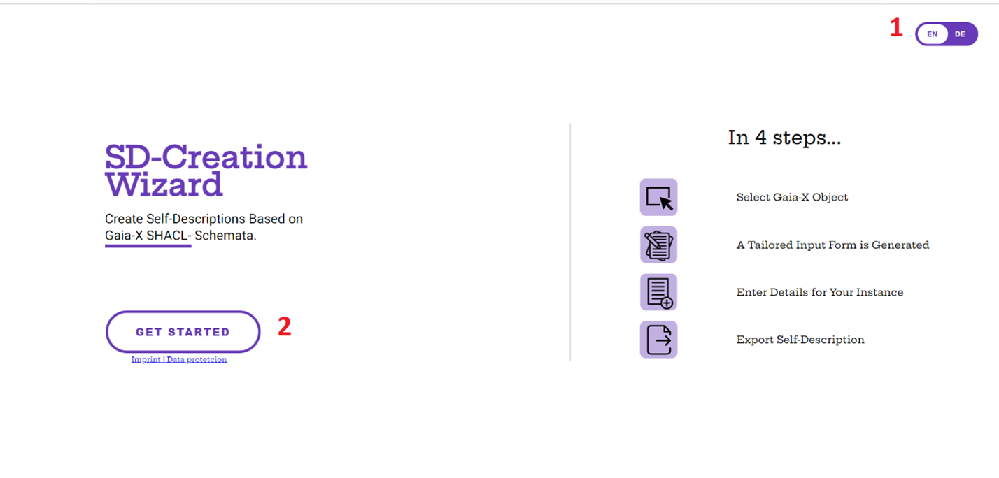
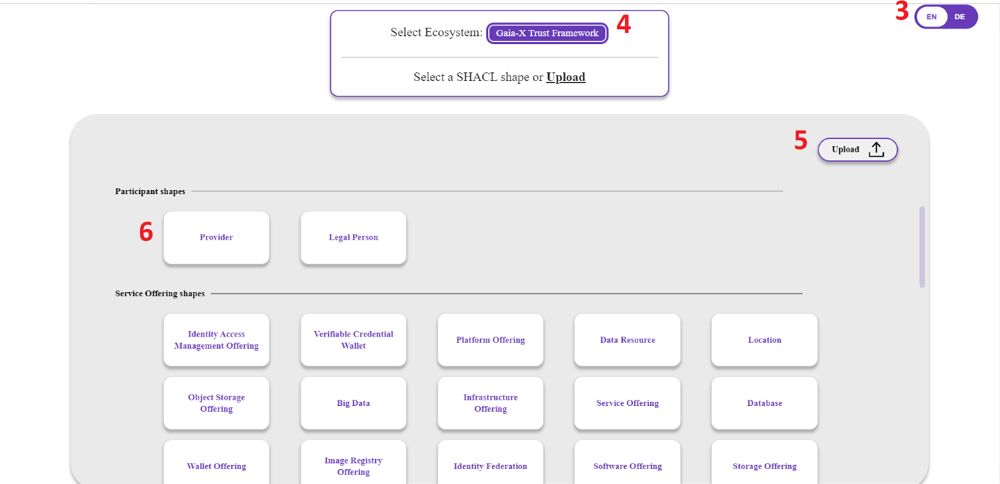
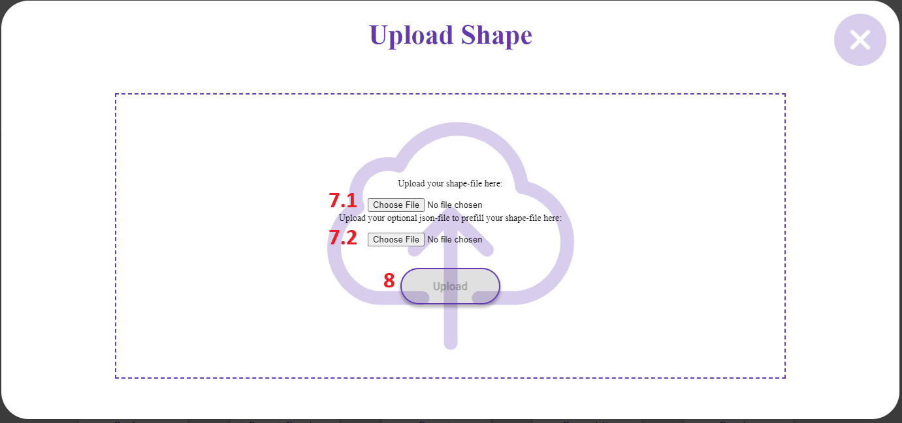

# Gaia-X Ecosystem

The Gaia-X Framework provides specifications and Open Source Software addressing the key building blocks to create data and infrastructure ecosystems.

The Gaia-X Architecture enables data - infrastructure ecosystems using the following elements: 
1)  [Gaia-X Conceptual Model](https://gaia-x.gitlab.io/technical-committee/architecture-document/conceptual_model/)
2)  [Gaia-X Operational Model] (https://gaia-x.gitlab.io/technical-committee/architecture-document/operating_model/)
3)  [Federation Services ](https://gaia-x.gitlab.io/technical-committee/architecture-document/conceptual_model/#federation-services)
4)  [Gaia-X Trust Framework](https://gaia-x.gitlab.io/technical-committee/architecture-document/operating_model/#gaia-x-trust-framework)

You can read more [here](https://gaia-x.gitlab.io/technical-committee/architecture-document/ecosystem/). 


# SD Creation Wizard

The SD Creation Wizard is developed to assist in creating [ Gaia-X Self-Descriptions](https://gaia-x.gitlab.io/technical-committee/architecture-document//self-description/)based on ontologies and SHACL shapes. Self-Descriptions describe Entities from the Gaia-X Conceptual Model in a machine interpretable format.


### Example usage (screenshots) and Static UI decomposition
The following pictures demonstrate how the system can be used, the possible actions of the system are demonstrated in the red colored numbers.
#### Home Page 

1)	Using this Button you can select the systems Language (English/German)
2)	Click on  ‘Get Started’ to access the page that allows you to create Self Descriptions 
#### Select Shape Page

3)	The language can also be changed from this page

There are two possible flows to proceed with creating a self-description either by:
a)	Using a pre-defined Gaia-X SHACL- Schemata

    4) You can choose between the shape’s Ecosystem (Gaia-X Trust Framework/Trusted Cloud)

    6) Select the desired shape
b)	Uploading your own SHACL- Schemata

    5) This button allows you to upload your own SHACL Schema

#### Upload shape Page


7.1) Click on Choose File to select your own schema

7.2) Click on Choose File to select your own claim file matching the schema to prefill the formfields (optional)

8) Your selected file names should appear above the button, afterwards click the upload button

#### Complete Form Page


9) The language can also be changed from this page

10) Fill out the fields (Required fields are demonstrated with an *)

11) Save/Export the generated Self-Description

12) You can return to the previous select shapes page


Example shape file for uploading:
```
@prefix dcat: <http://www.w3.org/ns/dcat#> .
@prefix dct: <http://purl.org/dc/terms/> .
@prefix sh: <http://www.w3.org/ns/shacl#> .
@prefix xsd: <http://www.w3.org/2001/XMLSchema#> .
@prefix ex: <http://example.com/ns#> .

ex:DatasetShape
    a sh:NodeShape ;
    sh:targetClass dcat:Dataset ;
    sh:property [
        sh:path dct:title ;
        sh:datatype xsd:string ;
        sh:name "Dataset title" ;
        sh:description "A free-text account of the item." ;
        sh:minCount 1 ;
        sh:maxCount 1;
		sh:order 1;
		sh:minLength 5;
		sh:maxLength 20;
    ] ;
    sh:property [
        sh:path dct:description ;
        sh:datatype xsd:string ;
        sh:name "Description" ;
		sh:maxCount 1;
		sh:order 2;
    ] ;
    sh:property [
        sh:path dcat:startDate ;
        sh:datatype xsd:dateTime ;
        sh:name "Start date of the data" ;
        sh:maxCount 1;
		sh:order 3;
    ] ;
    sh:property [
        sh:path dcat:endDate ;
        sh:datatype xsd:dateTime ;
        sh:name "End date of the data" ;
        sh:maxCount 1;
		sh:order 4;
    ] ;
    sh:property [
        sh:path dcat:keyword ;
        sh:datatype xsd:string ;
		sh:order 5;
    ] ;
	.
```
Example claim file for uploading:
```
{
  "@context": {
    "xsd": "http://www.w3.org/2001/XMLSchema#",
    "ex": "http://example.com/ns#",
    "dct": "http://purl.org/dc/terms/",
    "dcat": "http://www.w3.org/ns/dcat#",
    "sh": "http://www.w3.org/ns/shacl#"
  },
  "@id": "did:example:1234",
  "@type": "dcat:Dataset",
  "dct:title": {
    "@value": "Example",
    "@type": "xsd:string"
  },
  "dct:description": {
    "@value": "Example",
    "@type": "xsd:string"
  },
  "dcat:startDate": {
    "@value": "2024-07-17T12:51:32",
    "@type": "xsd:dateTime"
  },
  "dcat:endDate": {
    "@value": "2024-07-18T12:51:34",
    "@type": "xsd:dateTime"
  },
  "dcat:keyword": {
    "@value": "Example",
    "@type": "xsd:string"
  }
}
```
Exported TTL:
```
@prefix xsd: <http://www.w3.org/2001/XMLSchema#>.
@prefix ex: <http://example.com/ns#>.
@prefix dct: <http://purl.org/dc/terms/>.
@prefix dcat: <http://www.w3.org/ns/dcat#>.
@prefix sh: <http://www.w3.org/ns/shacl#>.

<http://example.org/xm2ghy2bbxo1t80htxogq8> a dcat:Dataset;
    dct:title "My room temperature"^^xsd:string;
    dct:description "Temperature in my room measured in Celsius."^^xsd:string;
    dcat:startDate "06/15/2021"^^xsd:dateTime;
    dcat:endDate "10/14/2021"^^xsd:dateTime;
    dcat:keyword "home office"^^xsd:string, "temperature"^^xsd:string.
```

## Development
The project is based on angular and Node, before cloning the repository make sure you have the following prerequists:

### Prerequisits for local development

* Npm: npm install -g npm
* Angular: npm install -g @angular/cli

### Commands to run Docker Image

1. `docker login to_be_changed:4567`
2. `docker pull to_be_changed:latest`
3. `docker pull to_be_changed2:latest`
3. `docker-compose up` (adjust the ports if required)
4. Use your web browser to browse to http://localhost/
